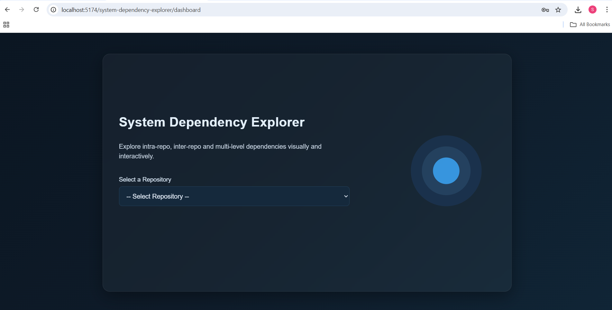
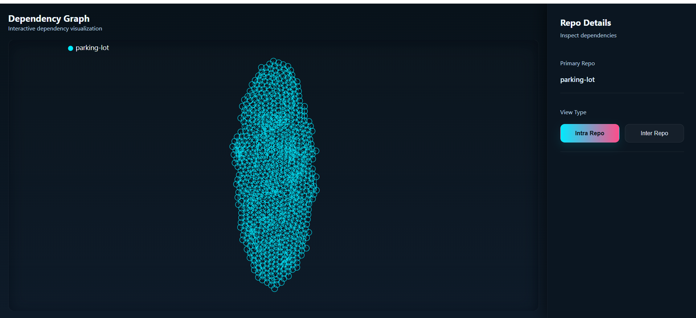
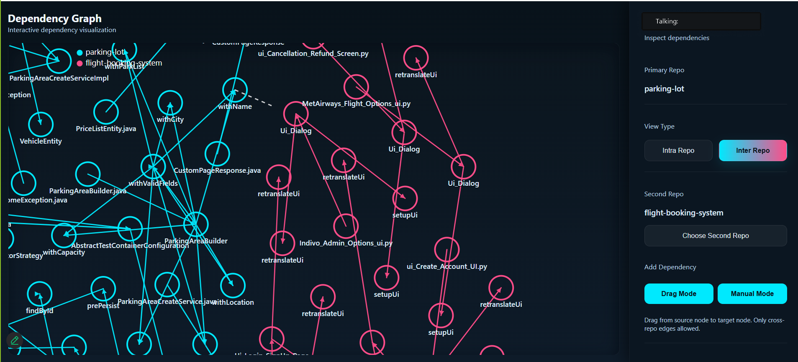

# **System Dependency Dashboard**

A refined and visually captivating interface for exploring complex system-level relationships with elegance and precision. Designed with modern engineering standards, this dashboard transforms dense dependency data into an intuitive, interactive visual narrative.

## ✨ **Key Highlights**

- **Immersive Dependency Visualization** powered by D3
- **Effortless Repository Navigation** with elegant UI panels  
- **Lightning-Fast Rendering** enabled by Vite and TypeScript  
- **Gracefully Designed Modals & Layouts** using modular SCSS  
- **Scalable Architecture** crafted for long-term extensibility  

## 🛠 **Tech Stack**

| Layer          | Tools & Versions |
|----------------|------------------|
| Framework      | React **19.2.0**, TypeScript **5.9.3** |
| Build System   | Vite **7.2.2** |
| Visualization  | D3 **7.9.0** |
| Styling        | SCSS (Sass **1.94.0**) |
| Utilities      | lodash **4.17.21**, Radix React Select **2.2.6** |
| Routing        | React Router DOM **7.9.5** |

## 📌 **Prerequisites**

Ensure the following before running the project:

- Node.js **18+**
- npm / yarn / pnpm
- A modern browser (Chrome, Edge, Firefox)

## 📁 **Project Structure (Overview)**

```
src/
├─ components/
├─ pages/
│  ├─ Dashboard/
│  ├─ LoginPage/
│  └─ RepoDetails/
│     ├─ GraphCanvas.tsx
│     ├─ AddDependencyModal.tsx
│     ├─ SidePanel.tsx
├─ data/
└─ App.tsx
```

## ⚙️ **Installation**

```bash
npm install
npm run dev
```


## ▶️ **Usage**

### Start Dev Mode  
```bash
npm run dev
```

## 📸 Screenshots

### Login View


### Dashboard View


### Graph View



### Add Dependency Modal



## 🔄 **Workflow Snapshot**

```
User → React App → Graph Engine (D3) → UI Panels & Modals
``` 

## 🛡 **Troubleshooting**

- **Graph invisible?** Check D3 logs  
- **SCSS not loading?** Validate imports  
- **Navigation issues?** Inspect sessionStorage token flow 
